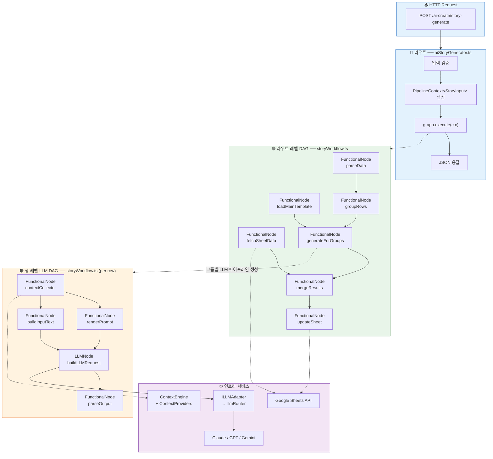
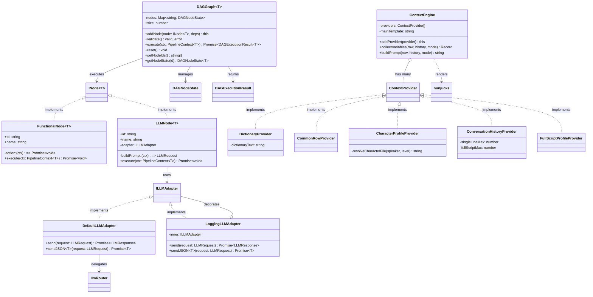
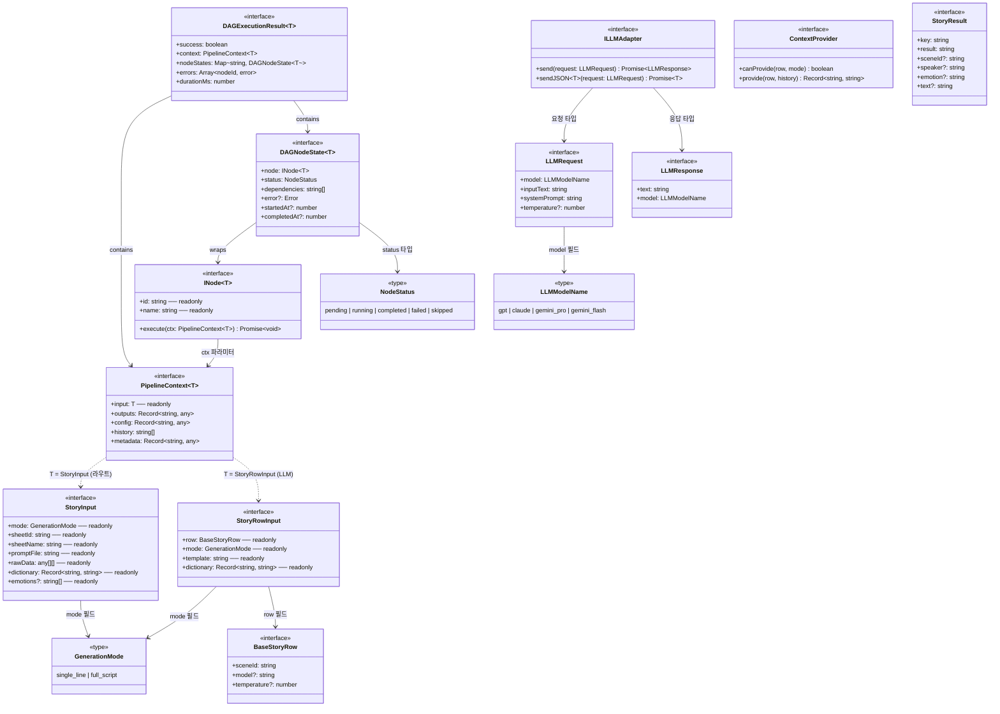

# DAG 아키텍처 다이어그램 (v2 — Generic Core/Feature 분리)

## 1. 단순화 흐름도 (Human-Friendly)

전체 시스템의 실행 흐름을 직관적으로 표현한 다이어그램입니다.
Core 엔진은 도메인에 무관하며, Feature 레이어가 스토리 생성 로직을 주입합니다.



---

## 2. 파일 의존 관계 (import 방향)

화살표 방향 = import 방향 (A → B = "A가 B를 import").
Core 계층은 Feature/Infra에 의존하지 않으며, Feature가 Core를 조합합니다.

```mermaid
flowchart BT
    subgraph CORE["🟢 Core (도메인 무관 — 수정 불필요)"]
        subgraph types["📦 types.ts"]
            T["PipelineContext&lt;T&gt;, INode&lt;T&gt;,<br/>DAGNodeState&lt;T&gt;, DAGExecutionResult&lt;T&gt;,<br/>NodeStatus, GenerationMode,<br/>BaseStoryRow, StoryResult"]
        end

        subgraph graph["📦 dagGraph.ts"]
            DG["DAGGraph&lt;T&gt;<br/>.addNode() .validate() .execute()"]
        end

        subgraph stdNodes["📦 standardNodes.ts"]
            SN["FunctionalNode&lt;T&gt;<br/>LLMNode&lt;T&gt;"]
        end

        subgraph adapter["📦 llmAdapter.ts"]
            LA["ILLMAdapter (interface)<br/>DefaultLLMAdapter<br/>LoggingLLMAdapter"]
        end
    end

    subgraph FEATURE["🟠 Feature (스토리 도메인)"]
        subgraph tools["📦 storyTools.ts"]
            ST["StoryInput, StoryRowInput<br/>parseData, loadMainTemplate,<br/>groupRows, fetchSheetData,<br/>mergeResults, updateSheet,<br/>createContextCollector,<br/>renderPrompt, buildInputText,<br/>parseOutput, buildLLMRequest"]
        end

        subgraph workflow["📦 storyWorkflow.ts"]
            SW["buildStoryRouteGraph()<br/>buildStoryLLMGraph()<br/>generateForGroups()<br/>executeRowPipeline()"]
        end
    end

    subgraph ROUTE["🔷 Route"]
        subgraph route["📦 aiStoryGenerator.ts"]
            RT["handleStoryGeneration()"]
        end
    end

    subgraph INFRA["⚙️ Infra (기존 유지)"]
        subgraph providers["📦 contextProviders.ts"]
            CP["ContextProvider (interface)<br/>Dictionary / CommonRow /<br/>CharacterProfile /<br/>ConversationHistory /<br/>FullScriptProfile"]
        end

        subgraph engine["📦 ContextEngine.ts"]
            CE["ContextEngine<br/>.collectVariables()"]
        end

        subgraph router["📦 llmRouter.ts"]
            LR["sendToLLM() / sendToLLMJSON()<br/>LLMRequest / LLMResponse"]
        end

        subgraph parsers["📦 outputParsers.ts"]
            OP["parseSingleLineText()<br/>parseFullScriptPSV()<br/>parseSingleLineJSON()<br/>parseFullScriptJSON()"]
        end

        subgraph sheet["📦 googleSheet.ts"]
            GS["getSheetData()<br/>updateSheetData()"]
        end
    end

    %% Core 내부 의존
    graph --> types
    stdNodes --> types
    stdNodes --> adapter
    adapter --> router

    %% Feature 의존
    tools --> types
    tools --> engine
    tools --> providers
    tools --> parsers
    tools --> sheet
    tools --> router

    workflow --> types
    workflow --> graph
    workflow --> stdNodes
    workflow --> adapter
    workflow --> tools

    %% Route 의존
    route --> types
    route --> workflow

    %% Infra 내부 의존
    engine --> types
    engine --> providers
    providers --> types
    parsers --> types

    style CORE fill:#e8f5e9,stroke:#2e7d32
    style FEATURE fill:#fff3e0,stroke:#e65100
    style ROUTE fill:#e3f2fd,stroke:#1565c0
    style INFRA fill:#f3e5f5,stroke:#6a1b9a
```

---

## 3. 상세 클래스 관계도

실제 TypeScript 클래스의 구현(implements), 의존(uses), 장식(decorates) 관계를 표현합니다.



---

## 4. 상세 인터페이스 관계도

TypeScript 인터페이스와 타입 간의 참조/포함 관계를 표현합니다.
Core 인터페이스는 제네릭 `T`로 파라미터화되어 도메인에 무관합니다.


