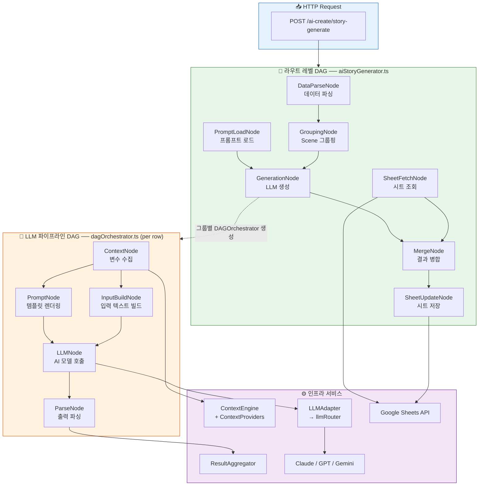
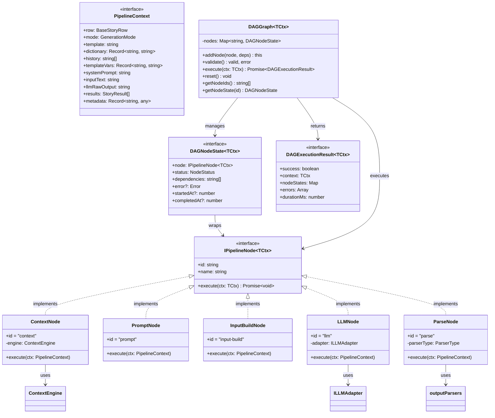
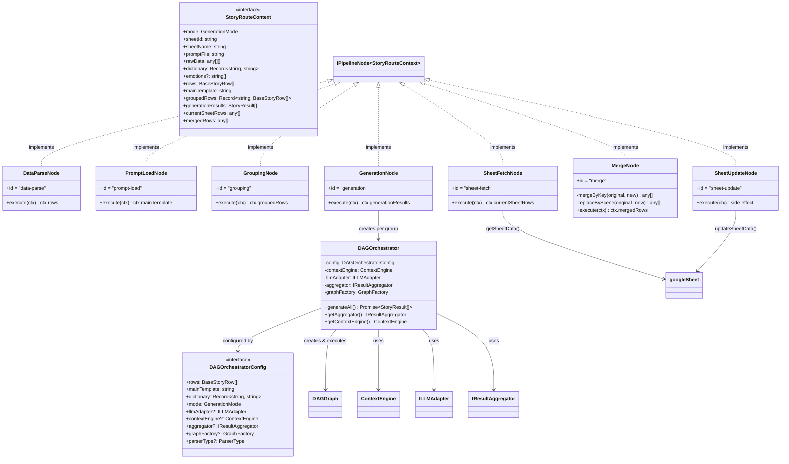
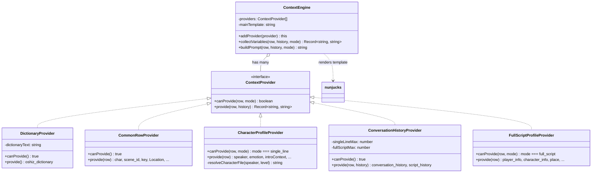
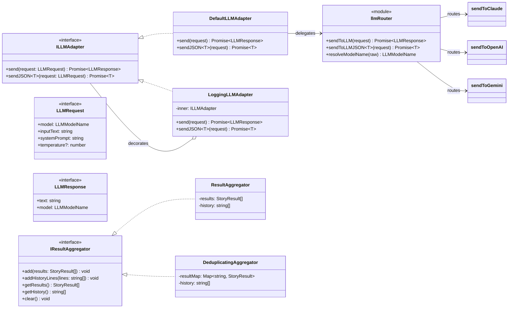

# DAG 아키텍처 다이어그램

## 1. 단순화 흐름도 (Human-Friendly)

파일 간 의존 관계와 실행 흐름을 직관적으로 표현한 다이어그램입니다.

### 1-1. 전체 시스템 흐름



### 1-2. 파일 의존 관계 (import 방향)

```mermaid
flowchart BT
    subgraph types["📦 server/types.ts"]
        T["GenerationMode, BaseStoryRow,<br/>StoryResult, PipelineContext,<br/>IPipelineNode, DAGNodeState"]
    end

    subgraph providers["📦 contextProviders.ts"]
        CP["ContextProvider (interface)<br/>Dictionary / CommonRow /<br/>CharacterProfile / ConversationHistory /<br/>FullScriptProfile"]
    end

    subgraph engine["📦 ContextEngine.ts"]
        CE["ContextEngine<br/>.collectVariables()<br/>.buildPrompt()"]
    end

    subgraph router["📦 llmRouter.ts"]
        LR["sendToLLM()<br/>sendToLLMJSON()<br/>LLMRequest / LLMResponse"]
    end

    subgraph parsers["📦 outputParsers.ts"]
        OP["parseSingleLineText()<br/>parseFullScriptPSV()<br/>parseSingleLineJSON()<br/>parseFullScriptJSON()"]
    end

    subgraph adapter["📦 llmAdapter.ts"]
        LA["ILLMAdapter (interface)<br/>DefaultLLMAdapter<br/>LoggingLLMAdapter"]
    end

    subgraph aggregator["📦 resultAggregator.ts"]
        RA["IResultAggregator (interface)<br/>ResultAggregator<br/>DeduplicatingAggregator"]
    end

    subgraph graph["📦 dagGraph.ts"]
        DG["DAGGraph&lt;TCtx&gt;<br/>.addNode() .execute()"]
    end

    subgraph nodes["📦 dagPipelineNodes.ts"]
        PN["ContextNode / PromptNode /<br/>InputBuildNode / LLMNode / ParseNode"]
    end

    subgraph orch["📦 dagOrchestrator.ts"]
        DO["DAGOrchestrator<br/>.generateAll()"]
    end

    subgraph routeNodes["📦 dagStoryRouteNodes.ts"]
        RN["StoryRouteContext<br/>DataParseNode / PromptLoadNode /<br/>GroupingNode / GenerationNode /<br/>SheetFetchNode / MergeNode / SheetUpdateNode"]
    end

    subgraph route["📦 aiStoryGenerator.ts"]
        RT["buildStoryDAG()<br/>handleStoryGeneration()"]
    end

    subgraph sheet["📦 googleSheet.ts"]
        GS["getSheetData()<br/>updateSheetData()"]
    end

    providers --> types
    engine --> types
    engine --> providers
    router --> types
    parsers --> types
    adapter --> router
    aggregator --> types
    graph --> types
    nodes --> types
    nodes --> engine
    nodes --> adapter
    nodes --> parsers
    orch --> types
    orch --> engine
    orch --> providers
    orch --> graph
    orch --> adapter
    orch --> aggregator
    orch --> nodes
    routeNodes --> types
    routeNodes --> orch
    routeNodes --> sheet
    route --> types
    route --> graph
    route --> routeNodes

    style types fill:#fff9c4,stroke:#f57f17
    style graph fill:#e8f5e9,stroke:#2e7d32
    style orch fill:#e8f5e9,stroke:#2e7d32
    style route fill:#e3f2fd,stroke:#1565c0
    style routeNodes fill:#e3f2fd,stroke:#1565c0
```

---

## 2. 클래스 · 인터페이스 상관 관계도 (Detailed)

실제 TypeScript 클래스/인터페이스의 구현(implements), 의존(uses), 포함(has) 관계를 표현합니다.

### 2-1. DAG 코어 + LLM 파이프라인 노드



### 2-2. 라우트 레벨 노드 + 오케스트레이터



### 2-3. ContextEngine + Provider 계층



### 2-4. LLM 어댑터 + 라우터 계층


