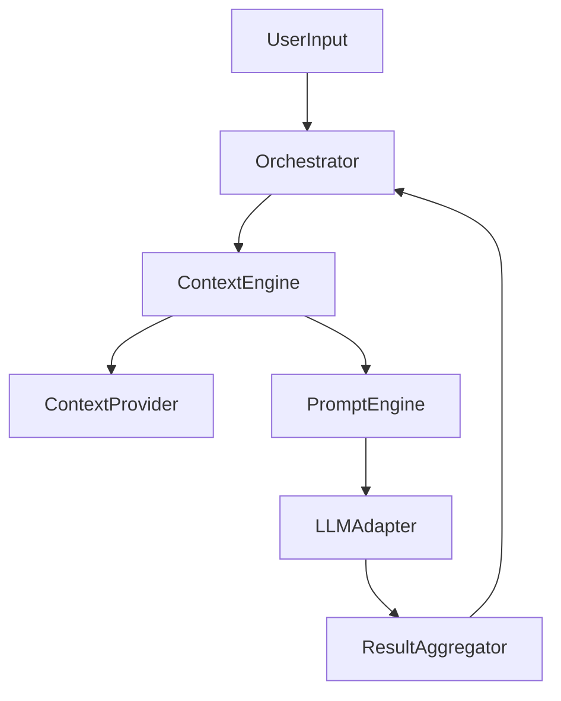

# DAG 기반 오케스트레이터 구현 리포트

## 1. 개요

기존의 `StoryOrchestrator` → `PromptEngine` → `sendToLLM` 선형 파이프라인을
**DAG(Directed Acyclic Graph) 기반** 아키텍처로 재설계하였습니다.

### 목표 제어 흐름



### 구현된 DAG 그래프 구조

```
ContextNode ──→ PromptNode ───┐
    │                          ├──→ LLMNode ──→ ParseNode
    └──→ InputBuildNode ──────┘
```

- `PromptNode`와 `InputBuildNode`는 `ContextNode`에만 의존하므로 **병렬 실행 가능**
- `LLMNode`은 두 노드가 모두 완료된 후 실행
- `ParseNode`는 `LLMNode` 완료 후 실행

---

## 2. 기존 아키텍처 분석 및 문제점

### 2.1 기존 구조

```
Route Handler
  → StoryOrchestrator.generateAll()
    → PromptEngine.buildPrompt()        (컨텍스트 수집 + 템플릿 렌더링)
    → sendToLLM()                         (LLM 호출)
    → parseSingleLineText/parseFullScriptPSV()  (결과 파싱)
    → history.push()                      (히스토리 관리)
```

### 2.2 식별된 문제점

| 문제 | 설명 | 영향 |
|------|------|------|
| **단일 책임 위반** | `StoryOrchestrator.generateAll()`이 프롬프트 빌드, LLM 호출, 파싱, 히스토리 관리를 모두 담당 | 테스트 어려움, 확장 시 코드 수정 범위 증가 |
| **선형 실행만 가능** | 파이프라인이 하드코딩된 순서로만 실행 | 병렬 LLM 호출, 조건부 분기 불가 |
| **LLM 직접 의존** | `sendToLLM` 함수를 직접 호출 | Mock/테스트, 캐싱, 로깅 데코레이터 적용 불가 |
| **결과 수집 분산** | 히스토리와 결과가 로컬 변수로 관리 | Row 간 상태 공유가 암묵적이고 추적 어려움 |
| **컨텍스트 수집과 렌더링 결합** | `ContextEngine.buildPrompt()`가 변수 수집과 렌더링을 한 번에 수행 | 중간 변수 조작, 캐싱 불가 |

---

## 3. 변경 사항 상세

### 3.1 신규 파일

| 파일 | 역할 |
|------|------|
| `server/services/dag/types.ts` | DAG 핵심 타입 (`PipelineContext`, `IPipelineNode`, `DAGNodeState`, `DAGExecutionResult`) |
| `server/services/dag/DAGGraph.ts` | DAG 그래프 구조 및 실행 엔진. 토폴로지 정렬, 병렬 실행, 순환 참조 탐지 |
| `server/services/dag/LLMAdapter.ts` | LLM 어댑터 인터페이스(`ILLMAdapter`) 및 구현(`DefaultLLMAdapter`, `LoggingLLMAdapter`) |
| `server/services/dag/ResultAggregator.ts` | 결과 집계기(`IResultAggregator`, `ResultAggregator`, `DeduplicatingAggregator`) |
| `server/services/dag/pipelineNodes.ts` | 5개 파이프라인 노드 구현(`ContextNode`, `PromptNode`, `InputBuildNode`, `LLMNode`, `ParseNode`) |
| `server/services/dag/DAGOrchestrator.ts` | DAG 기반 오케스트레이터. 기존 `StoryOrchestrator`와 동일한 외부 API |
| `server/services/dag/index.ts` | 모듈 공개 API re-export |

### 3.2 수정된 파일

| 파일 | 변경 내용 |
|------|----------|
| `server/services/ContextEngine.ts` | `collectVariables()` 메서드 추가. 변수 수집과 렌더링 분리. `buildPrompt()`는 내부적으로 `collectVariables()`를 호출하도록 리팩터링 |
| `server/routes/aiStoryGenerator.ts` | `DAGOrchestrator` import 추가, 핸들러에서 `StoryOrchestrator` → `DAGOrchestrator` 교체 |

### 3.3 미변경 파일 (하위 호환)

| 파일 | 이유 |
|------|------|
| `server/services/storyOrchestrator.ts` | 기존 코드가 직접 참조할 경우를 위해 보존 |
| `server/services/PromptEngine.ts` | ContextEngine 래퍼로서의 역할 유지 |
| `server/services/llmRouter.ts` | LLMAdapter가 내부적으로 사용 |
| `server/services/outputParsers.ts` | ParseNode가 내부적으로 사용 |
| `server/services/contextProviders.ts` | ContextNode가 ContextEngine을 통해 사용 |

---

## 4. 핵심 설계 결정

### 4.1 PipelineContext (공유 상태 객체)

```typescript
interface PipelineContext {
    // 불변 입력
    readonly row: BaseStoryRow;
    readonly mode: GenerationMode;
    readonly template: string;
    readonly dictionary: Record<string, string>;

    // 공유 상태
    history: string[];

    // 노드 출력 (각 노드가 순차적으로 채움)
    templateVars: Record<string, string>;   // ← ContextNode
    systemPrompt: string;                    // ← PromptNode
    inputText: string;                       // ← InputBuildNode
    llmRawOutput: string;                    // ← LLMNode
    results: StoryResult[];                  // ← ParseNode

    // 확장 메타데이터
    metadata: Record<string, any>;
}
```

**설계 근거**: 노드 간 데이터 전달을 명시적 파라미터 대신 공유 컨텍스트로 수행합니다.
이를 통해 새 노드 추가 시 기존 노드의 인터페이스를 변경할 필요가 없습니다.

### 4.2 DAGGraph 실행 알고리즘

```
1. validate() — 순환 참조 및 누락 의존성 탐지
2. while (미완료 노드 존재):
   a. findReadyNodes() — 의존성이 충족된 노드 탐색
   b. Promise.allSettled() — 준비된 노드 병렬 실행
   c. 실패 시 → 의존 노드 스킵 처리 후 중단
3. 결과 반환 (성공/실패, 노드 상태, 소요 시간)
```

### 4.3 의존성 주입

`DAGOrchestrator`는 모든 핵심 의존성을 주입 가능하도록 설계:

```typescript
new DAGOrchestrator({
    rows, mainTemplate, dictionary, mode,
    llmAdapter: new LoggingLLMAdapter(),     // 커스텀 LLM
    contextEngine: customEngine,              // 커스텀 컨텍스트
    aggregator: new DeduplicatingAggregator(), // 커스텀 집계
    graphFactory: customGraphFactory,          // 커스텀 DAG 구성
    parserType: 'json',                        // JSON 파서 선택
});
```

---

## 5. 확장 가이드

### 5.1 커스텀 파이프라인 노드 추가

```typescript
import { IPipelineNode, PipelineContext } from './dag/types';

export class ValidationNode implements IPipelineNode {
    readonly id = 'validation';
    readonly name = '입력 유효성 검증';

    async execute(ctx: PipelineContext): Promise<void> {
        if (!ctx.row['key']) {
            throw new Error('key 필드가 필요합니다');
        }
    }
}

// DAG에 등록
graph.addNode(new ValidationNode(), []);           // 의존성 없음 (최초 실행)
graph.addNode(new ContextNode(engine), ['validation']); // 검증 후 실행
```

### 5.2 병렬 LLM 호출 (다중 모델 비교)

```typescript
function multiModelGraphFactory(engine, adapter, parserType): DAGGraph {
    const graph = new DAGGraph();
    const claudeAdapter = new DefaultLLMAdapter();
    const gptAdapter = new DefaultLLMAdapter();

    graph
        .addNode(new ContextNode(engine), [])
        .addNode(new PromptNode(), ['context'])
        .addNode(new InputBuildNode(), ['context'])
        // 두 LLM을 병렬로 호출
        .addNode(new LLMNode(claudeAdapter), ['prompt', 'input-build'])
        .addNode(new LLMNode(gptAdapter), ['prompt', 'input-build'])  // id 변경 필요
        .addNode(new ParseNode(parserType), ['llm']);

    return graph;
}
```

### 5.3 커스텀 LLMAdapter (캐싱, 재시도 등)

```typescript
class RetryLLMAdapter implements ILLMAdapter {
    private inner: ILLMAdapter;
    private maxRetries: number;

    constructor(inner: ILLMAdapter, maxRetries = 3) {
        this.inner = inner;
        this.maxRetries = maxRetries;
    }

    async send(request: LLMRequest): Promise<LLMResponse> {
        for (let attempt = 0; attempt < this.maxRetries; attempt++) {
            try {
                return await this.inner.send(request);
            } catch (e) {
                if (attempt === this.maxRetries - 1) throw e;
                await new Promise(r => setTimeout(r, 1000 * (attempt + 1)));
            }
        }
        throw new Error('최대 재시도 횟수 초과');
    }

    async sendJSON<T>(request: LLMRequest): Promise<T> {
        return this.inner.sendJSON<T>(request);
    }
}
```

### 5.4 커스텀 ContextProvider 추가

```typescript
class EmotionContextProvider implements ContextProvider {
    private emotions: string[];

    constructor(emotions: string[]) {
        this.emotions = emotions;
    }

    canProvide(_row: BaseStoryRow, mode: GenerationMode): boolean {
        return mode === 'full_script';
    }

    provide(): Record<string, string> {
        return { emotions: this.emotions.join(', ') };
    }
}

// ContextEngine에 등록
const engine = orchestrator.getContextEngine();
engine.addProvider(new EmotionContextProvider(['happy', 'sad', 'angry']));
```

---

## 6. 취약점 분석 및 개선 방안

### 6.1 현재 취약점

| 카테고리 | 취약점 | 심각도 | 위치 |
|----------|--------|--------|------|
| **타입 안전성** | `BaseStoryRow`의 `[key: string]: any` 인덱스 시그니처로 인해 런타임 에러 위험 | 중 | `server/types.ts:16` |
| **에러 복구** | DAG 실행 중 한 row 실패 시 해당 row만 건너뛰지만, 히스토리 연속성이 깨질 수 있음 | 중 | `DAGOrchestrator.ts:generateAll()` |
| **메모리** | 대규모 배치에서 `ResultAggregator`가 모든 결과를 메모리에 보유 | 하 | `ResultAggregator.ts` |
| **순환 참조 탐지** | DAG 검증은 실행 시점에만 수행되며, 그래프 구성 시점에는 검증하지 않음 | 하 | `DAGGraph.ts:execute()` |
| **PipelineContext 가변성** | 공유 컨텍스트 객체가 가변이므로 병렬 노드 간 경쟁 조건 가능성 (현재 기본 파이프라인에서는 발생하지 않으나 커스텀 그래프에서 주의 필요) | 중 | `dag/types.ts:PipelineContext` |
| **프롬프트 인젝션** | 사용자 입력(`introContext`, `speaker` 등)이 프롬프트 템플릿에 직접 삽입됨 | 중 | `pipelineNodes.ts:InputBuildNode` |

### 6.2 기존 코드의 잠재적 이슈

| 이슈 | 설명 | 위치 |
|------|------|------|
| `mainTemplate.replace()` 반환값 미사용 | `String.replace()`는 새 문자열을 반환하지만 결과를 할당하지 않음 (`const`이므로 재할당 불가) | `aiStoryGenerator.ts:44` |
| `as any` 타입 캐스팅 다수 | `parseFullScriptPSV`와 `parseFullScriptJSON`에서 `as any` 캐스팅이 타입 안전성을 저해 | `outputParsers.ts:73,137` |
| 하드코딩된 기본 모델 | `gemini_flash`가 여러 곳에 하드코딩 | `storyOrchestrator.ts:39`, `pipelineNodes.ts:LLMNode` |

### 6.3 향후 개선 제안

1. **PipelineContext 불변성 강화**: 각 노드의 출력을 개별 타입으로 분리하여 읽기/쓰기 제어
2. **DAG 직렬화**: DAG 구조를 JSON/YAML로 정의하고 런타임에 로드하는 기능
3. **이벤트 시스템**: 노드 실행 전/후 이벤트 훅을 통한 모니터링/로깅
4. **스트리밍 지원**: LLMAdapter에 스트리밍 인터페이스 추가
5. **테스트 프레임워크 도입**: Jest/Vitest로 DAG 실행 로직 단위 테스트

---

## 7. 파일 구조 (변경 후)

```
server/
├── services/
│   ├── dag/                          # [신규] DAG 파이프라인 모듈
│   │   ├── index.ts                  # 공개 API re-export
│   │   ├── types.ts                  # 핵심 타입 정의
│   │   ├── DAGGraph.ts               # DAG 그래프 + 실행 엔진
│   │   ├── DAGOrchestrator.ts        # DAG 기반 오케스트레이터
│   │   ├── LLMAdapter.ts             # LLM 어댑터
│   │   ├── ResultAggregator.ts       # 결과 집계기
│   │   └── pipelineNodes.ts          # 파이프라인 노드 구현체
│   ├── ContextEngine.ts              # [수정] collectVariables() 추가
│   ├── PromptEngine.ts               # [미변경] 하위 호환 래퍼
│   ├── storyOrchestrator.ts          # [미변경] 레거시 오케스트레이터
│   ├── contextProviders.ts           # [미변경]
│   ├── llmRouter.ts                  # [미변경]
│   ├── outputParsers.ts              # [미변경]
│   └── ...
├── routes/
│   ├── aiStoryGenerator.ts           # [수정] DAGOrchestrator 사용
│   └── ...
└── types.ts                          # [미변경]
```

---

## 8. Before / After 비교

### Before (기존 StoryOrchestrator)

```typescript
// 모든 로직이 generateAll() 하나에 집중
const orchestrator = new StoryOrchestrator(rows, mainTemplate, dictionary, mode);
const results = await orchestrator.generateAll();
// 내부에서: buildPrompt → sendToLLM → parse → history update (모두 하드코딩)
```

### After (DAGOrchestrator)

```typescript
// 동일한 외부 인터페이스, 내부는 DAG 기반
const orchestrator = new DAGOrchestrator({
    rows, mainTemplate, dictionary, mode,
    // 선택적: 커스텀 어댑터, 파서, 그래프 구성
});
const results = await orchestrator.generateAll();
// 내부에서: DAGGraph 생성 → 노드별 실행 → ResultAggregator 수집
```

### 확장성 비교

| 작업 | Before | After |
|------|--------|-------|
| 새 컨텍스트 추가 | `ContextProvider` 작성 + 등록 | 동일 (변경 없음) |
| LLM 재시도 로직 추가 | `sendToLLM` 함수 수정 또는 Orchestrator 수정 | `RetryLLMAdapter` 래퍼 구현 후 주입 |
| 파싱 전략 변경 | Orchestrator 코드 직접 수정 | `ParseNode` 생성자에 파서 타입 전달 |
| 병렬 LLM 비교 | 불가 (선형 파이프라인) | 커스텀 `GraphFactory`로 DAG 구성 |
| 중간 결과 로깅 | Orchestrator 코드에 로그 삽입 | `LoggingLLMAdapter` 사용 또는 커스텀 노드 추가 |
| 파이프라인 단계 추가 | Orchestrator 코드 직접 수정 | `IPipelineNode` 구현 + DAG에 노드 추가 |
